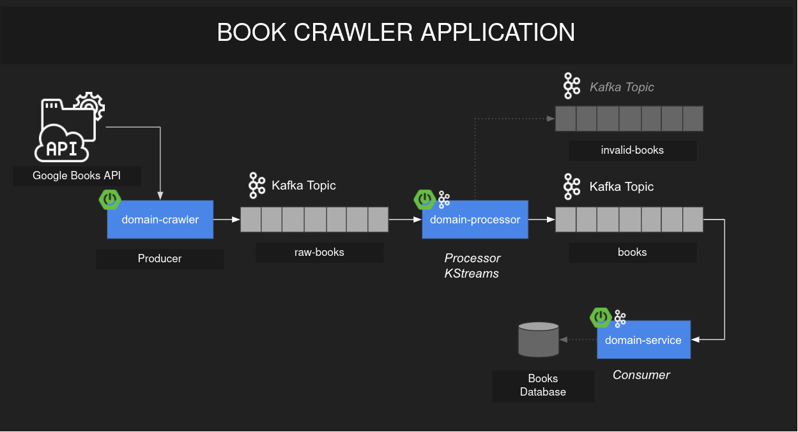
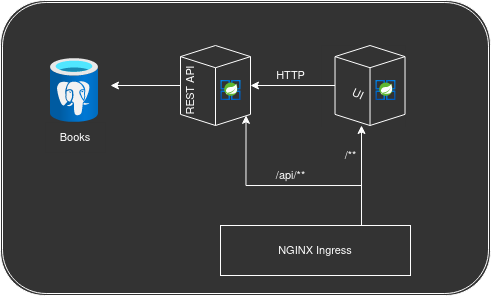

# librarianship-crawler
  The application aims to receving, processing and persisting data. In this case Google Books API has a role of data source from which the producer microservice
receives data, map it to the object representation and sends it to the processor microservice via kafka messages. The processor listen to the certain kafka topic, maps 
data, filters objects and sends them to different kafka topic that depends on object validation. The last microservice is comsumer, the only responsibility of which is
to persist filtered data in the database.
  Another project [librarianship](https://github.com/Swoq/librarianship) works with the same database and exposes REST API as well as UI HTTP endpoints. UI built 
using server-side template processing, [Thymeleaf](https://www.thymeleaf.org/).

